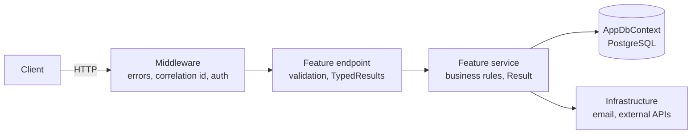

# Architecture overview

DotnetApiTemplate is a single ASP.NET Core Minimal API backed by PostgreSQL.

## Request flow

1. Middleware handles exceptions, correlation ids, authentication and authorization.
2. The endpoint binds and validates the request DTO, then calls one service method.
3. The service applies business rules and returns a `Result<T>`.
4. The endpoint converts the result to `200/201/204` or a `ProblemDetails` error.

## Folders

| Folder | Responsibility |
| --- | --- |
| `Features/` | One folder per business feature: endpoints, service, DTOs, mappings |
| `Domain/` | Entities and enums, no framework dependencies |
| `Data/` | EF Core `AppDbContext`, entity configurations, migrations (applied manually) |
| `Infrastructure/` | Authentication (JWT), email (Scriban templates, PreMailer.Net, MailKit), clients for external services |
| `Common/` | Cross-cutting code: errors and exceptions, middleware, results, pagination, settings, JSON, CORS, OpenAPI, registration |

## Cross-cutting decisions

- Authentication: JWT bearer tokens; every `/api` endpoint requires auth unless marked `AllowAnonymous`.
- Errors: RFC 7807 `ProblemDetails` for every non-2xx response.
- Validation: .NET 10 built-in validation on request DTOs.
- Observability: `X-Correlation-Id` on every response and in the log scope; `/health` endpoint.
- Configuration: environment variables / `.env`, typed settings classes marked `IEnvSettings`, found
  automatically and validated at startup.
- Database: schema changes only through migrations applied manually; nothing runs at startup.
- Background jobs: Hangfire with PostgreSQL (schema `hangfire`); one build runs as `api`, `worker` or `all`
  (`APP_ROLE`); the production image runs API + worker in one container with supervisor.
- Feature wiring: manual by default, or auto-discovery of `IEndpoints` classes and `XService : IXService`
  (`Common/Features/FeatureDiscovery.cs`); a route snapshot test guards the route table in both modes.
- Dependency injection is validated at startup (`ValidateOnBuild`, `ValidateScopes`) in every environment.

Developer guides for each topic: [docs/README.md](../README.md).
